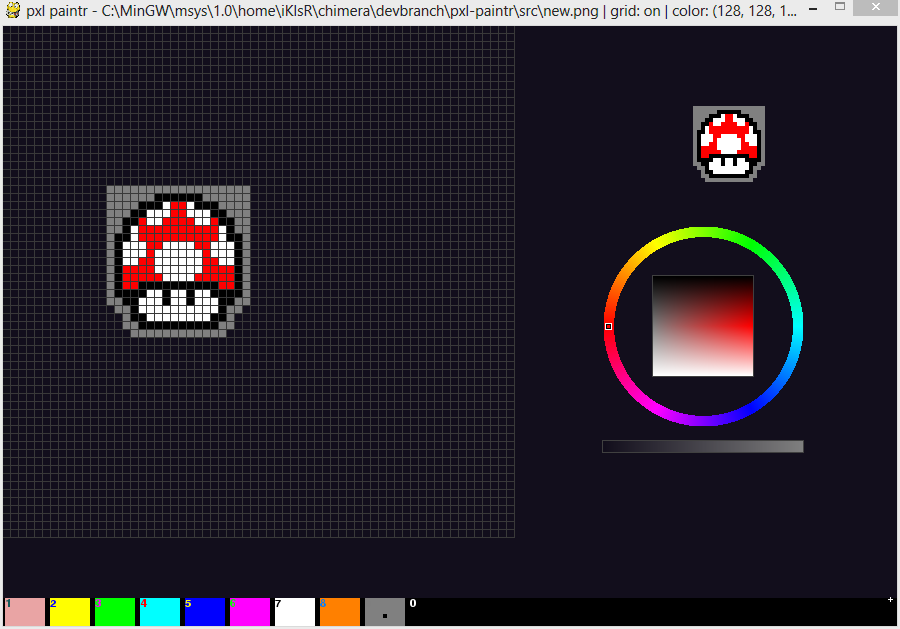

pxl-paintr
==========

A simple pixel art app. It uses [pygame](https://pygame.org). Here is an 

# Keys

**`LMB`** *(Left click)* - Click to add *pixels*, hold to draw continuously

**`MMB`** *(Middle click)* - *n/a*

**`RMB`** *(Right click)* - Click points to delete, hold to delete continuously

**`H`** - Toggle the assist grid *on/off*

**`P`** - Toggle the small preview *(actual size when saved)* (perspective helps sometimes)

**`F`** - Completely clear the canvas

**`1 - 9`** - To select colors as they are shown at the bottom in the fixed palette

**`ESC`** - Quit

**`S`** - Save to current directory

Notes
====
1. To create a new file start the main program `pxlee.py` with the name of the file as an argument. Example. `python pxlee.py new_sprite`.

2. You do not need to add an extension when starting it, it will automatically save your image as a `256 * 256` png with alpha by default.

3. The current slot in the fixed palette will change when the color wheel is modified.

4. Be sure to save your scene as it will not prompt you to save.

5. The interactive color picker on the right changes the color in the active selected palette!

6. The status of the current scene can be seen in the window header and updates in real-time.
